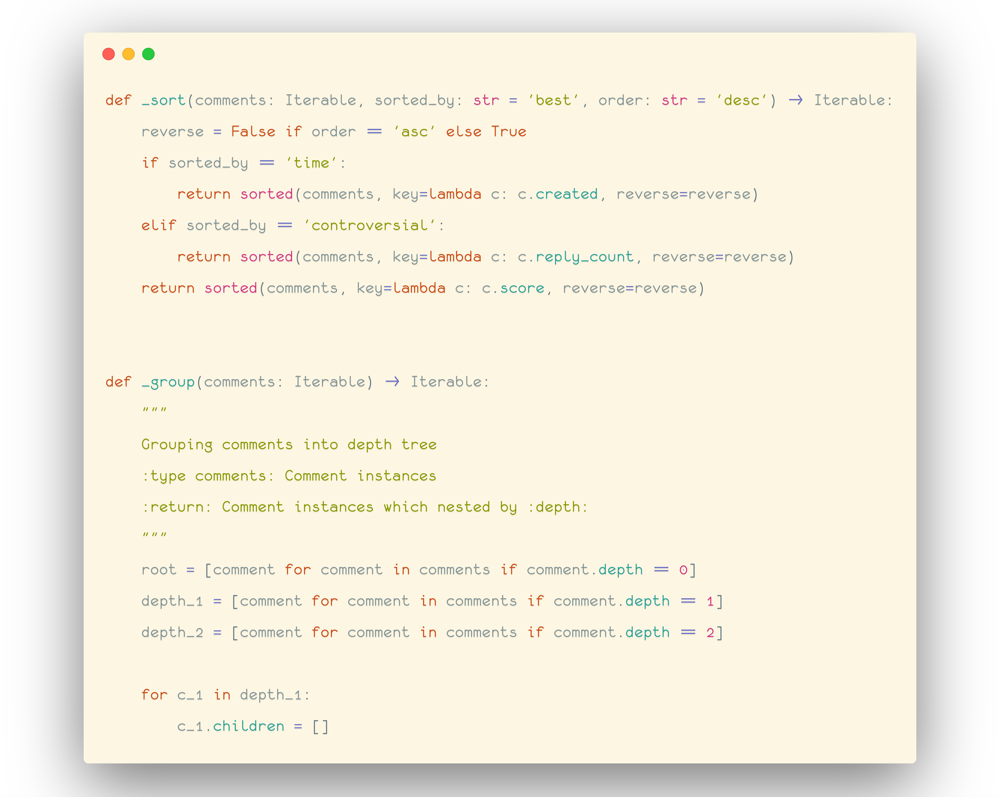
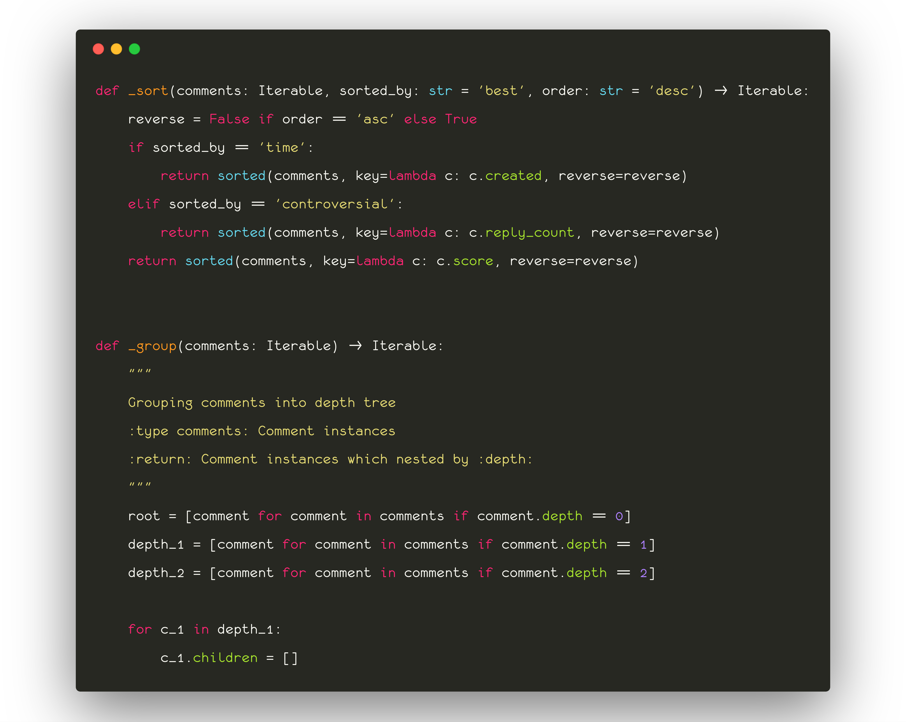
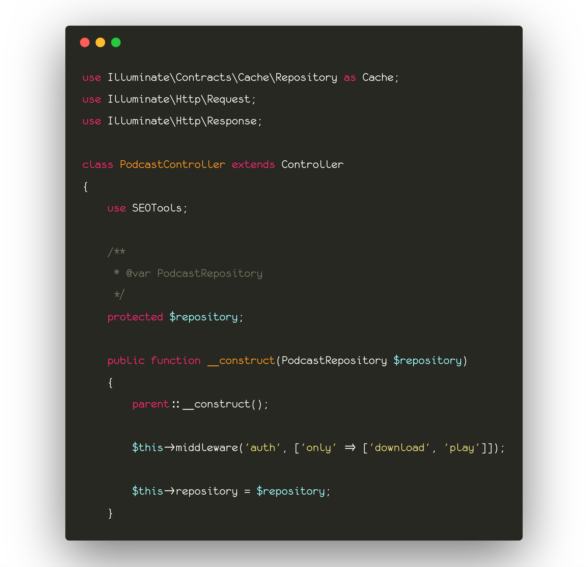
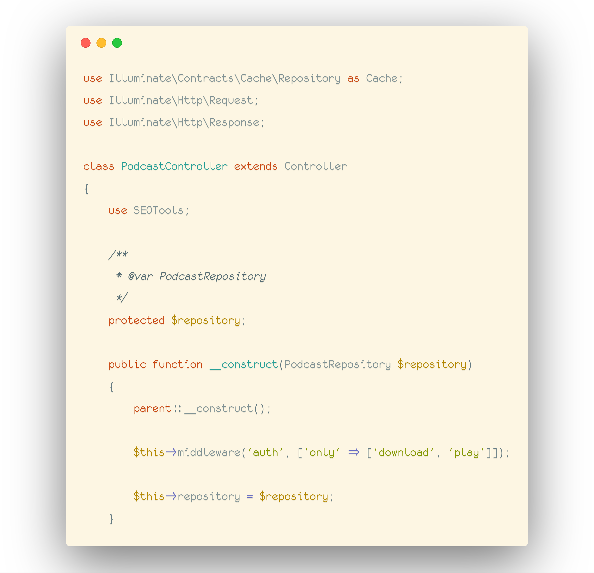

# Coding-fonts
Storing free/open-source fonts that I've been using for coding. The font originated 
from monofur with additional unicode characters (including all Vietnamese accents) and ligatures.
Some example:

